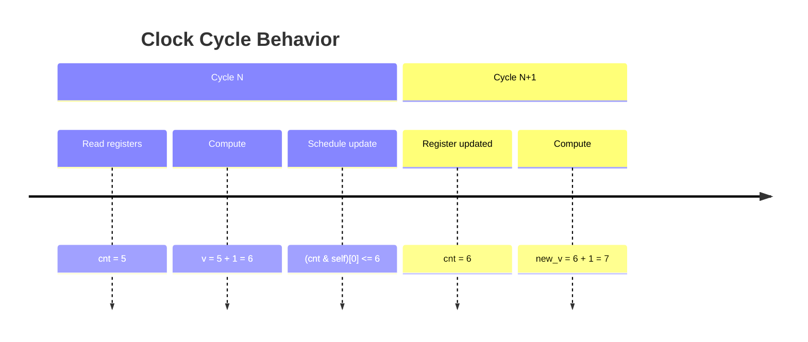

# Assassyn Documentation

> **Quick Start:** For a quick syntax reference, check out [`assassyn基本语法速查.md`](assassyn基本语法速查.md) (Chinese quick reference with examples).

## Table of Contents
1. [Introduction](#introduction)
2. [Core Concepts](#core-concepts)
3. [Module System](#module-system)
4. [State Management](#state-management)
5. [Combinational Logic](#combinational-logic)
6. [Module Communication](#module-communication)
7. [Special Components](#special-components)
8. [System Building](#system-building)
9. [Simulation](#simulation)
10. [Best Practices](#best-practices)

## Introduction

Assassyn is a Python-based hardware description language that allows you to write RTL-like code using Python syntax. It bridges the gap between software programming and hardware design, enabling developers to create hardware models using familiar Python constructs while maintaining the semantics of hardware description languages.

### Key Features

- **Python Syntax**: Write hardware models using Python
- **RTL Semantics**: Maintains register-transfer level timing model
- **Module System**: Hierarchical design with reusable components
- **Type System**: Strong typing for hardware signals
- **Simulation**: Built-in simulation capabilities
- **Verilog Generation**: Can generate Verilog for synthesis

## Core Concepts

### Registers vs Variables

In Assassyn, registers (hardware state) behave differently from Python variables:

```python
# Python variable (immediate update)
counter = 0
counter = counter + 1  # Immediately 1
print(counter)  # Outputs: 1

# Assassyn register (delayed update)
cnt = RegArray(UInt(32), 1)  # 32-bit register
v = cnt[0] + UInt(32)(1)     # Read current value and compute
(cnt & self)[0] <= v         # Schedule update for next cycle
# cnt[0] is still the old value in this cycle
```

**Key Difference**: Register updates take effect in the next clock cycle, not immediately.

### Clock Cycles

Hardware operates in discrete time units called cycles:



Each cycle consists of:
1. Reading current register values
2. Performing combinational logic
3. Scheduling register updates for next cycle

## Module System

### Basic Module Structure

```python
from assassyn.frontend import *

class MyModule(Module):
    def __init__(self):
        super().__init__(ports={
            'input1': Port(UInt(32)),
            'input2': Port(UInt(32)),
            'output': Port(UInt(32))
        })
        
    @module.combinational
    def build(self):
        # Module logic goes here
        pass
```

### Module Types

1. **Regular Modules**: Have ports and perform specific functions
2. **Driver Modules**: No ports, drive the entire system
3. **Special Modules**: SRAM, FIFO, etc.

## State Management

### Register Arrays

Use `RegArray` to define state:

```python
@module.combinational
def build(self):
    # Different register types
    counter = RegArray(UInt(32), 1)        # 32-bit counter
    flags = RegArray(Bits(1), 4)           # 4 flag bits
    buffer = RegArray(UInt(8), 256)        # 256-byte buffer
    state_machine = RegArray(Bits(2), 1)    # 2-bit state
```

### Register Updates

```python
@module.combinational
def build(self):
    cnt = RegArray(UInt(32), 1)
    
    # Read current value
    current = cnt[0]
    
    # Compute new value
    new_value = current + UInt(32)(1)
    
    # Schedule update for next cycle
    (cnt & self)[0] <= new_value
```

**Important**: Always use the computed value (`new_value`) rather than trying to read the register after update.

## Combinational Logic

### Basic Operations

```python
@module.combinational
def build(self):
    a, b = self.pop_all_ports(True)
    
    # Arithmetic operations
    sum = a + b
    diff = a - b
    product = a * b
    
    # Bitwise operations
    and_result = a & b
    or_result = a | b
    shifted = a << 2
    
    # Comparisons
    is_equal = (a == b)
    is_greater = (a > b)
    
    # Type conversions
    bits_val = a.bitcast(Bits(32))
    int_val = bits_val.bitcast(Int(32))
```

### Conditional Logic

Use `with Condition()` for hardware-friendly conditionals:

```python
@module.combinational
def build(self):
    cnt = RegArray(UInt(32), 1)
    enable = RegArray(Bits(1), 1)
    
    # Conditional update
    with Condition(enable[0] == Bits(1)(1)):
        (cnt & self)[0] <= cnt[0] + UInt(32)(1)
    
    # Conditional execution
    with Condition(cnt[0] < UInt(32)(100)):
        log("Counter is less than 100")
```

## Module Communication

### Asynchronous Calls

Modules communicate through `async_called()`:

```python
# Caller module
class Driver(Module):
    @module.combinational
    def build(self, processor: DataProcessor):
        data = some_calculation()
        
        # Asynchronous call
        processor.async_called(
            input_data=data,
            enable=Bits(1)(1)
        )

# Called module
class DataProcessor(Module):
    def __init__(self):
        super().__init__(ports={
            'input_data': Port(UInt(32)),
            'enable': Port(Bits(1))
        })
    
    @module.combinational
    def build(self):
        input_data, enable = self.pop_all_ports(True)
        
        # Process the received data
        with Condition(enable == Bits(1)(1)):
            result = input_data * UInt(32)(2)
            log("Processed: {} -> {}", input_data, result)
```

### Port Access

Always use `pop_all_ports()` to access port values:

```python
# Correct way
def build(self):
    a, b, c = self.pop_all_ports(True)
    # Use a, b, c

# Incorrect way
def build(self):
    a = self.a  # This doesn't work!
```

## Special Components

### SRAM (Static RAM)

```python
# Create SRAM
sram = SRAM(width=32, depth=512, init_file="data.hex")

# SRAM interface
sram.build(
    we,           # Write enable (Bits(1))
    re,           # Read enable (Bits(1))
    addr,          # Address (Int(9))
    wdata,         # Write data (Bits(32))
    user           # Downstream module for read data
)

# Read SRAM data
class SRAMUser(Module):
    def __init__(self):
        super().__init__(ports={'rdata': Port(Bits(32))})
    
    @module.combinational
    def build(self):
        rdata = self.pop_all_ports(False)
        # Process read data
```

### FIFO (First-In-First-Out)

```python
class FIFO(Module):
    def __init__(self, width=32, depth=16):
        super().__init__(ports={
            'data_in': Port(Bits(width)),
            'write_en': Port(Bits(1)),
            'read_en': Port(Bits(1))
        })
        
        # FIFO state
        self.buffer = RegArray(Bits(width), depth)
        self.read_ptr = RegArray(UInt(log2(depth)), 1)
        self.write_ptr = RegArray(UInt(log2(depth)), 1)
        self.count = RegArray(UInt(log2(depth) + 1), 1)
    
    @module.combinational
    def build(self):
        data_in, write_en, read_en = self.pop_all_ports(True)
        
        # Write logic
        with Condition(write_en & ~self.is_full()):
            self.buffer[self.write_ptr[0]] <= data_in
            self.write_ptr[0] <= self.write_ptr[0] + UInt(log2(depth))(1)
            self.count[0] <= self.count[0] + UInt(log2(depth) + 1)(1)
        
        # Read logic
        with Condition(read_en & ~self.is_empty()):
            output_data = self.buffer[self.read_ptr[0]]
            self.read_ptr[0] <= self.read_ptr[0] + UInt(log2(depth))(1)
            self.count[0] <= self.count[0] - UInt(log2(depth) + 1)(1)
```

## System Building

### System Builder Pattern

```python
from assassyn.frontend import *
from assassyn.backend import elaborate
from assassyn import utils

def build_system():
    sys = SysBuilder('my_system')
    with sys:
        # Instantiate modules
        counter = Counter()
        processor = DataProcessor()
        driver = Driver()
        
        # Build modules
        counter.build()
        processor.build()
        driver.build(counter, processor)
        
        # Expose top-level signals if needed
        sys.expose_on_top(some_signal)
    
    return sys
```

### Module Hierarchy

```python
# Top-level system
sys = SysBuilder('top_system')
with sys:
    # Create subsystems
    memory_system = MemorySubsystem()
    compute_unit = ComputeUnit()
    control_unit = ControlUnit()
    
    # Connect modules
    control_unit.build(memory_system, compute_unit)
    memory_system.build()
    compute_unit.build()
```

## Simulation

### Running Simulation

```python
def run_simulation():
    # Build system
    sys = build_system()
    
    # Generate simulator
    simulator_path, verilator_path = elaborate(sys, verilog=utils.has_verilator())
    
    # Run simulation
    raw = utils.run_simulator(simulator_path)
    print(raw)
```

### Debugging with Logs

```python
@module.combinational
def build(self):
    cnt = RegArray(UInt(32), 1)
    
    # Log current state
    log("Counter value: {}", cnt[0])
    
    # Log conditional events
    with Condition(cnt[0] == UInt(32)(100)):
        log("Reached milestone!")
    
    # Log complex expressions
    result = complex_calculation()
    log("Calculation result: {}", result)
```

## Best Practices

### State Update Patterns

```python
@module.combinational
def build(self):
    # Define all registers first
    cnt = RegArray(UInt(32), 1)
    addr = RegArray(UInt(32), 1)
    flag = RegArray(Bits(1), 1)
    
    # Read current values
    current_cnt = cnt[0]
    current_addr = addr[0]
    current_flag = flag[0]
    
    # Compute all new values
    new_cnt = current_cnt + UInt(32)(1)
    new_addr = current_addr + UInt(32)(4)
    new_flag = ~current_flag
    
    # Update all registers together
    (cnt & self)[0] <= new_cnt
    (addr & self)[0] <= new_addr
    (flag & self)[0] <= new_flag
```

### Common Pitfalls to Avoid

1. **Don't read after write**:
```python
# Wrong
(cnt & self)[0] <= cnt[0] + 1
result = cnt[0]  # Still old value!

# Correct
new_value = cnt[0] + 1
(cnt & self)[0] <= new_value
result = new_value
```

2. **Don't use Python if for hardware conditions**:
```python
# Wrong
if enable:  # Python if, not hardware condition
    do_something()

# Correct
with Condition(enable):
    do_something()
```

3. **Don't access ports directly**:
```python
# Wrong
value = self.port_name

# Correct
value = self.pop_all_ports(True)
```

### Performance Considerations

1. **Minimize register usage**: Only store what's necessary
2. **Optimize logic**: Simplify combinational expressions
3. **Use appropriate data types**: Choose minimal width for signals
4. **Pipeline when needed**: Break complex operations into stages

## Type System

### Basic Types

```python
# Unsigned integers
UInt(8)    # 8-bit unsigned
UInt(16)   # 16-bit unsigned
UInt(32)   # 32-bit unsigned

# Signed integers
Int(8)     # 8-bit signed
Int(16)    # 16-bit signed
Int(32)    # 32-bit signed

# Bit vectors
Bits(1)    # Single bit
Bits(8)    # 8-bit vector
Bits(32)   # 32-bit vector
```

### Type Conversions

```python
# Integer to bits
bits_val = int_val.bitcast(Bits(32))

# Bits to integer
int_val = bits_val.bitcast(Int(32))

# Between signed and unsigned
signed_val = unsigned_val.bitcast(Int(32))
unsigned_val = signed_val.bitcast(UInt(32))
```

## Advanced Features

### Parameterized Modules

```python
class ParameterizedAdder(Module):
    def __init__(self, width=32):
        super().__init__(ports={
            'a': Port(UInt(width)),
            'b': Port(UInt(width)),
            'sum': Port(UInt(width))
        })
        self.width = width
    
    @module.combinational
    def build(self):
        a, b = self.pop_all_ports(True)
        result = a + b
        log("Adding: {} + {} = {}", a, b, result)
```

### State Machines

```python
class FSM(Module):
    def __init__(self):
        super().__init__(ports={
            'input': Port(Bits(1)),
            'output': Port(Bits(1))
        })
        
        # State definitions
        self.IDLE = Bits(2)(0)
        self.WORKING = Bits(2)(1)
        self.DONE = Bits(2)(2)
    
    @module.combinational
    def build(self):
        input_sig = self.pop_all_ports(True)
        
        # State register
        state = RegArray(Bits(2), 1)
        current_state = state[0]
        
        # State transitions
        with Condition(current_state == self.IDLE):
            with Condition(input_sig == Bits(1)(1)):
                (state & self)[0] <= self.WORKING
        
        with Condition(current_state == self.WORKING):
            (state & self)[0] <= self.DONE
        
        with Condition(current_state == self.DONE):
            (state & self)[0] <= self.IDLE
```

## Conclusion

Assassyn provides a powerful way to model hardware using Python syntax while maintaining proper hardware semantics. By understanding the key concepts of registers, cycles, and combinational logic, you can create complex hardware systems that are both correct and efficient.

Remember the key principles:
- Register updates happen in the next cycle
- Use `with Condition()` for hardware conditionals
- Access ports through `pop_all_ports()`
- Think in terms of parallel hardware operations

With these concepts, you can build sophisticated hardware models that can be simulated and potentially synthesized into actual hardware.