# Assassyn 入门教程：从 Python 到硬件设计

> **目标读者：** 会 Python，但不完全理解体系结构/RTL，没写过 Verilog/VHDL，完全不了解 Assassyn 的开发者

> **学习目标：** 理解 Assassyn 的基本建模思想，正确区分状态与计算，写出一个可运行、行为符合预期的 Assassyn 模型

> **💡 快速开始：** 如果你想快速了解基本语法，可以先查看 [`assassyn基本语法速查.md`](assassyn基本语法速查.md)，然后再回来深入学习概念。

---

## 1️⃣ 使用 Assassyn 前必须理解的最少概念

### 什么是"状态/寄存器"？

在普通 Python 中，我们习惯于变量可以随时修改：

```python
# 普通 Python 代码
counter = 0
counter = counter + 1  # 立即生效
print(counter)  # 输出: 1
```

但在 Assassyn 中，**寄存器（状态）** 完全不同：

```python
# Assassyn 代码
cnt = RegArray(UInt(32), 1)  # 创建一个32位寄存器
v = cnt[0] + UInt(32)(1)     # 读取当前值并计算新值
(cnt & self)[0] <= v         # 安排在下一个时钟周期更新
```

**本质区别：**
- 普通 Python 变量：立即修改，立即生效
- Assassyn 寄存器：**当前周期读取，下一个周期才更新**

```mermaid
timeline
    title Python 变量 vs Assassyn 寄存器
    section Python 变量
        周期 N : counter = 0
        周期 N : counter = counter + 1  (立即生效)
        周期 N : print(counter)  (输出: 1)
    section Assassyn 寄存器
        周期 N : cnt[0] = 0
        周期 N : (cnt & self)[0] <= cnt[0] + 1  (安排更新)
        周期 N : print(cnt[0])  (输出: 0，还是旧值)
        周期 N+1 : cnt[0] = 1  (新值生效)
```



**如果没这样理解，代码会写错在哪里？**
```python
# 错误理解：以为会立即生效
(cnt & self)[0] <= cnt[0] + UInt(32)(1)
result = cnt[0]  # 错误！这里读的还是旧值，不是刚刚+1后的值

# 正确理解：保存计算值
new_value = cnt[0] + UInt(32)(1)
(cnt & self)[0] <= new_value
result = new_value  # 使用计算值
```

### 什么是"周期/tick"？

**周期**是硬件世界的基本时间单位。每个周期内：
1. 所有寄存器**同时**读取上一周期的值
2. 所有组合逻辑**并行**计算
3. 计算结果**同时**写入寄存器（下一周期可见）

```mermaid
flowchart LR
    subgraph 周期 N
        A["读取寄存器<br>cnt = 5"] --> B["组合逻辑计算<br>v = 5 + 1 = 6"]
        B --> C["安排更新<br>(cnt & self)[0] <= 6"]
    end
    
    subgraph 周期 N+1
        D["寄存器更新<br>cnt = 6"] --> E["组合逻辑计算<br>new_v = 6 + 1 = 7"]
    end
    
    C --> D
```

```python
# 周期 N：读取 cnt = 5
v = cnt[0] + UInt(32)(1)  # 计算 v = 6
(cnt & self)[0] <= v        # 安排更新

# 周期 N+1：cnt 现在是 6
new_v = cnt[0] + UInt(32)(1)  # 计算 new_v = 7
```

**如果没这样理解，代码会写错在哪里？**
```python
# 错误：以为可以链式更新
(cnt & self)[0] <= cnt[0] + UInt(32)(1)  # 5 -> 6
(cnt & self)[0] <= cnt[0] + UInt(32)(2)  # 以为能 6 -> 8，实际还是 5 -> 7
```

### 什么是"组合逻辑"？

**组合逻辑**是"每个周期里反复计算的规则"，就像数学函数：

```python
# 组合逻辑：输入确定，输出就确定
def add(a, b):
    return a + b  # 纯计算，没有状态
```

在 Assassyn 中，组合逻辑写在 `@module.combinational` 装饰的函数里：

```python
@module.combinational
def build(self):
    a, b = self.pop_all_ports(True)  # 读取输入
    c = a + b                       # 组合逻辑计算
    log("a + b = {}", c)            # 输出结果
```

**组合逻辑的特点：**
- 没有记忆功能
- 输入相同，输出一定相同
- 在一个周期内完成计算

**如果没这样理解，代码会写错在哪里？**
```python
# 错误：在组合逻辑中试图保存状态
@module.combinational
def build(self):
    if self.some_condition:  # 错误！组合逻辑不应该有"记忆"
        self.counter = self.counter + 1
```

---

## 2️⃣ Assassyn 中你是如何"写一个系统"的

### Assassyn 代码大致长什么样

一个完整的 Assassyn 系统通常包含：

```mermaid
flowchart TD
    A[导入模块] --> B[定义硬件模块]
    B --> C[构建系统]
    C --> D[生成仿真器]
    D --> E[运行仿真]
```



```python
# 1. 导入必要模块
from assassyn.frontend import *
from assassyn.backend import elaborate
from assassyn import utils

# 2. 定义硬件模块
class MyModule(Module):
    def __init__(self):
        super().__init__(ports={})  # 定义端口
        
    @module.combinational
    def build(self):
        # 组合逻辑和状态更新
        pass

# 3. 构建系统
def test_my_system():
    sys = SysBuilder('my_system')
    with sys:
        module = MyModule()
        module.build()
    
    # 4. 生成仿真器并运行
    simulator_path, verilator_path = elaborate(sys, verilog=utils.has_verilator())
    raw = utils.run_simulator(simulator_path)
    print(raw)
```

### 哪些部分是"长期存在的状态"

**状态**通过 `RegArray` 定义，长期存在：

```python
class Counter(Module):
    @module.combinational
    def build(self):
        # 这些是长期存在的状态
        cnt = RegArray(UInt(32), 1)        # 计数器
        flag = RegArray(Bits(1), 1)        # 标志位
        history = RegArray(UInt(32), 10)   # 历史记录
        
        # 状态更新
        (cnt & self)[0] <= cnt[0] + UInt(32)(1)
```

**状态的特点：**
- 使用 `RegArray` 声明
- 通过 `(reg & self)[index] <= value` 更新
- 在下一个周期才可见新值

### 哪些部分是"每个周期都会重新计算的规则"

**组合逻辑**每个周期重新计算：

```python
@module.combinational
def build(self):
    cnt = RegArray(UInt(32), 1)
    
    # 这些是每个周期重新计算的规则
    current_value = cnt[0]                    # 读取当前状态
    doubled = current_value * UInt(32)(2)     # 计算
    is_even = (current_value & UInt(32)(1)) == UInt(32)(0)  # 判断
    
    # 条件执行
    with Condition(is_even):
        log("偶数: {}", current_value)
```

### 周期是如何推动系统前进的

**Driver 模块**是系统的引擎：

```mermaid
flowchart LR
    subgraph 每个周期
        A[Driver 执行] --> B[读取状态]
        B --> C[计算新值]
        C --> D[更新状态]
        D --> E[调用其他模块]
    end
    
    subgraph 周期推进
        F[周期 N] --> G[周期 N+1]
        G --> H[周期 N+2]
    end
    
    E --> F
```

```python
class Driver(Module):
    def __init__(self):
        super().__init__(ports={})  # Driver 通常没有端口
        
    @module.combinational
    def build(self):
        # Driver 每个周期都会被执行
        cnt = RegArray(UInt(32), 1)
        (cnt & self)[0] <= cnt[0] + UInt(32)(1)
        
        # 推动其他模块
        with Condition(cnt[0] < UInt(32)(100)):
            self.other_module.async_called(data=cnt[0])
```

**Driver 的特点：**
- 没有端口（通常）
- 每个周期无条件执行
- 负责驱动整个系统

---

## 3️⃣ 从 examples 中学到的真实使用方式

### 一个可运行的 Assassyn 模型通常由哪些部分组成？

分析 examples 目录，我们发现一个完整模型包含：

1. **状态定义**：使用 `RegArray` 定义寄存器
2. **组合逻辑**：在 `@module.combinational` 函数中
3. **模块间通信**：通过 `async_called` 和端口
4. **系统构建**：使用 `SysBuilder` 组织模块
5. **仿真运行**：调用 `elaborate` 和 `utils.run_simulator`

```python
# 典型结构（来自 examples/asic_axbplusc.py）
class PlusC(Module):
    def __init__(self):
        super().__init__(ports={
            'a': Port(Int(32)),
            'b': Port(Int(32)),
            'c': Port(Int(64)),
            'axb': Port(Int(64)),
            'cnt': Port(Int(32))
        })
        
    @module.combinational
    def build(self, stage4_reg: Array):
        a, b, c, axb, cnt = self.pop_all_ports(True)
        stage4_reg[0] = axb + c  # 状态更新
        with Condition(cnt == Int(32)(37)):
            log("The result of {:?} * {:?} + {:?} = {:?}", a, b, c, stage4_reg[0])
```

### 多模块之间的互相调用（异步调用）

在 Assassyn 中，模块间通过 `async_called` 进行异步通信：

```python
# 调用者模块
class Driver(Module):
    @module.combinational
    def build(self, target: TargetModule):
        # 准备数据
        data = some_calculation()
        
        # 异步调用目标模块
        target.async_called(param1=data, param2=other_value)
        
        # 调用会延迟一个周期执行
        log("发送数据到目标模块: {}", data)

# 被调用模块
class TargetModule(Module):
    def __init__(self):
        super().__init__(ports={
            'param1': Port(Int(32)),
            'param2': Port(Int(32))
        })
    
    @module.combinational
    def build(self):
        # 接收调用参数
        param1, param2 = self.pop_all_ports(True)
        
        # 执行处理逻辑
        result = param1 + param2
        
        log("接收到数据: {} + {} = {}", param1, param2, result)
```

**关键特点：**
- 调用者使用 `target.async_called(...)` 发起调用
- 被调用者通过 `self.pop_all_ports(True)` 接收参数
- 调用会在下一个周期执行，形成流水线

### 初学者最容易犯的错误有哪些？

1. **混淆立即更新和延迟更新**
```python
# 错误：以为立即生效
(cnt & self)[0] <= cnt[0] + 1
result = cnt[0]  # 错误！读的是旧值

# 正确：理解延迟
v = cnt[0] + 1
(cnt & self)[0] <= v
result = v  # 使用计算值
```



```mermaid
timeline
    title 错误 vs 正确的寄存器更新
    section 错误方式
        周期 N : (cnt & self)[0] <= cnt[0] + 1
        周期 N : result = cnt[0]  (错误！读旧值)
    section 正确方式
        周期 N : v = cnt[0] + 1
        周期 N : (cnt & self)[0] <= v
        周期 N : result = v  (正确！用计算值)
```

2. **在组合逻辑中试图保存状态**
```python
# 错误：组合逻辑中不应该有状态
@module.combinational
def build(self):
    if some_condition:
        self.state = self.state + 1  # 错误！

# 正确：使用寄存器
@module.combinational
def build(self):
    state = RegArray(UInt(32), 1)
    with Condition(some_condition):
        (state & self)[0] <= state[0] + UInt(32)(1)
```

3. **端口使用错误**
```python
# 错误：直接访问端口
def build(self):
    a = self.a  # 错误！

# 正确：通过 pop_all_ports
def build(self):
    a, b = self.pop_all_ports(True)
```

### tutorials 没明说、但 examples 实际依赖的重要约定

1. **模块命名约定**
```python
# Driver 作为入口模块
class Driver(Module):
    pass

# 其他功能模块有描述性名称
class Adder(Module):
    pass

class MemoryController(Module):
    pass
```

2. **状态更新模式**
```python
# 集中更新状态
@module.combinational
def build(self):
    cnt = RegArray(UInt(32), 1)
    addr = RegArray(UInt(32), 1)
    
    # 先计算所有新值
    new_cnt = cnt[0] + 1
    new_addr = addr[0] + 4
    
    # 然后集中更新
    (cnt & self)[0] <= new_cnt
    (addr & self)[0] <= new_addr
```

3. **条件执行模式**
```python
# 使用 with Condition
with Condition(enable):
    # 条件为真时执行的逻辑
    self.target.async_called(data=value)

# 而不是 if-else
if enable:  # 错误！这是 Python 的 if，不是硬件的条件
    self.target.async_called(data=value)
```

---

## 4️⃣ 为什么 Assassyn 要"看起来像 RTL"（弱理论版）

### 为什么 Assassyn 强调"寄存器 + 周期"

**硬件的本质**是：
- 有限的状态存储（寄存器）
- 离散的时间推进（时钟周期）
- 并行的组合逻辑计算

Assassyn 的设计直接反映了这个本质：

```python
# 寄存器（状态存储）
cnt = RegArray(UInt(32), 1)

# 周期（离散时间）
# 每个 build() 调用代表一个周期

# 组合逻辑（并行计算）
result = cnt[0] * UInt(32)(2)
```

### 为什么不能像普通 Python 一样随意改状态

**硬件的限制**：
- 所有寄存器同时更新，不能有先后顺序
- 组合逻辑没有记忆，不能依赖历史
- 时序必须明确，不能有隐式依赖

```python
# Python 风格：顺序执行
a = a + 1
b = a * 2  # b 使用更新后的 a

# RTL 风格：并行执行
new_a = a + 1
new_b = a * 2  # b 使用原来的 a
(a & self)[0] <= new_a
(b & self)[0] <= new_b
```

### 这种写法相比普通 Python 模拟带来的好处是什么

1. **可综合**：能转换成真实的硬件电路
2. **性能可预测**：每个周期的行为确定
3. **并行性明确**：天然支持硬件并行
4. **时序精确**：能准确建模硬件时序

```mermaid
flowchart LR
    subgraph Assassyn 代码
        A["cnt = RegArray(UInt(32), 1)"] --> B["doubled = cnt[0] * 2"]
        B --> C["(cnt & self)[0] <= doubled"]
    end
    
    subgraph 对应硬件
        D["32位寄存器"] --> E["组合逻辑乘法器"]
        E --> F["寄存器更新"]
    end
    
    A -.-> D
    B -.-> E
    C -.-> F
```

```python
# Assassyn 代码直接对应硬件
cnt = RegArray(UInt(32), 1)           # 32位寄存器
doubled = cnt[0] * UInt(32)(2)        # 组合逻辑乘法器
(cnt & self)[0] <= doubled            # 寄存器更新
```

---

## 5️⃣ 实际上手指南（How-to）

### 步骤1：明确你要建模的状态是什么

**思考问题**：你的系统需要记住什么信息？

```mermaid
mindmap
  root((系统状态))
    计数器
      当前值
    FIFO
      存储数据
      读指针
      写指针
    状态机
      当前状态
      计时器
    缓存
      有效位
      标签
      数据
```



**示例**：计数器需要记住当前计数值
```python
# 状态：当前计数值
cnt = RegArray(UInt(32), 1)
```

**示例**：FIFO 需要记住存储的数据和读写指针
```python
# 状态：存储数组、读指针、写指针
data = RegArray(UInt(32), 16)
read_ptr = RegArray(UInt(4), 1)
write_ptr = RegArray(UInt(4), 1)
```

### SRAM（静态随机存取存储器）

SRAM 是 Assassyn 中用于大容量存储的组件：

```python
# 创建 SRAM
sram = SRAM(width=32, depth=512, init_file="data.hex")

# SRAM 接口
sram.build(
    we,           # 写使能 (Bits(1))
    re,           # 读使能 (Bits(1))
    addr,          # 地址 (Int(9))
    wdata          # 写数据 (Bits(32))
)

# 读取 SRAM 数据（通过下游模块）
class MemUser(Module):
    def __init__(self):
        super().__init__(ports={'rdata': Port(Bits(32))})
        
    @module.combinational
    def build(self):
        rdata = self.pop_all_ports(False)  # 读取 SRAM 输出
        # 处理读取的数据
        processed = rdata + UInt(32)(1)
        log("SRAM 数据: {} -> {}", rdata, processed)
```

**SRAM 的特点：**
- 大容量存储（通常比 RegArray 大）
- 同步读取：读数据延迟一个周期
- 需要控制信号：写使能、读使能、地址
- 可选初始化文件

### FIFO（先进先出队列）

FIFO 是常用的数据结构，在 Assassyn 中可以这样实现：

```python
class FIFO(Module):
    def __init__(self, width=32, depth=16):
        super().__init__(ports={
            'data_in': Port(Bits(width)),
            'read_en': Port(Bits(1))
        })
        
        # FIFO 状态
        self.buffer = RegArray(Bits(width), depth)
        self.read_ptr = RegArray(UInt(log2(depth)), 1)
        self.write_ptr = RegArray(UInt(log2(depth)), 1)
        self.count = RegArray(UInt(log2(depth)+1), 1)
    
    @module.combinational
    def build(self):
        data_in, read_en = self.pop_all_ports(True)
        
        # 写入逻辑
        with Condition(~self.is_full()):
            self.buffer[self.write_ptr[0]] <= data_in
            self.write_ptr[0] <= self.write_ptr[0] + 1
            self.count[0] <= self.count[0] + 1
        
        # 读取逻辑
        with Condition(read_en & ~self.is_empty()):
            output_data = self.buffer[self.read_ptr[0]]
            self.read_ptr[0] <= self.read_ptr[0] + 1
            self.count[0] <= self.count[0] - 1
        
        # 状态查询辅助方法
        def is_full():
            return self.count[0] == UInt(depth)(0)
        
        def is_empty():
            return self.count[0] == UInt(0)(0)
```

**FIFO 的特点：**
- 先进先出的数据管理
- 需要管理读写指针和计数
- 需要处理空/满状态
- 常用于模块间数据缓冲

### 步骤2：用 Assassyn 定义这些状态

**基本模式**：
```python
class MyModule(Module):
    @module.combinational
    def build(self):
        # 定义状态
        state1 = RegArray(Type1, size1)
        state2 = RegArray(Type2, size2)
        # ...
```

**常见状态类型**：
```python
# 计数器
counter = RegArray(UInt(32), 1)

# 标志位
flags = RegArray(Bits(1), 4)

# 数据缓冲区
buffer = RegArray(UInt(8), 256)

# 状态机
fsm_state = RegArray(Bits(2), 1)
```

### 步骤3：写出每个周期更新状态的规则

**基本模式**：
```python
@module.combinational
def build(self):
    # 读取当前状态
    current = self.state[0]
    
    # 计算新值
    new_value = some_calculation(current)
    
    # 更新状态（下一周期生效）
    (self.state & self)[0] <= new_value
```

**示例：带条件的状态更新**
```python
@module.combinational
def build(self):
    cnt = RegArray(UInt(32), 1)
    current = cnt[0]
    
    # 计算新值
    incremented = current + UInt(32)(1)
    
    # 条件更新
    with Condition(current < UInt(32)(100)):
        (cnt & self)[0] <= incremented
```

### 步骤4：驱动仿真并观察行为

**基本模式**：
```python
def test_my_system():
    # 构建系统
    sys = SysBuilder('my_system')
    with sys:
        module = MyModule()
        module.build()
    
    # 生成仿真器
    simulator_path, verilator_path = elaborate(sys, verilog=utils.has_verilator())
    
    # 运行仿真
    raw = utils.run_simulator(simulator_path)
    print(raw)
```

**添加日志观察行为**：
```python
@module.combinational
def build(self):
    cnt = RegArray(UInt(32), 1)
    current = cnt[0]
    
    # 添加日志
    log("当前计数: {}", current)
    
    # 更新状态
    (cnt & self)[0] <= current + UInt(32)(1)
```

### 如果结果不对，应该优先检查哪一类问题

1. **时序问题**：是否混淆了当前值和下一周期值？
```python
# 检查：是否在更新后立即读取？
(cnt & self)[0] <= new_value
result = self.state[0]  # 错误！这里还是旧值
```

2. **条件问题**：条件是否正确？
```python
# 检查：条件是否写反了？
with Condition(cnt < UInt(32)(100)):  # 应该是 > 还是 <？
    # ...
```

3. **端口问题**：是否正确使用端口？
```python
# 检查：是否直接访问端口？
a = self.port_a  # 错误！
a, b = self.pop_all_ports(True)  # 正确
```

---

## 6️⃣ 初学者真正需要知道的接口（最小集合）

### 状态（寄存器）相关接口

```python
# 创建寄存器
cnt = RegArray(UInt(32), 1)           # 32位计数器
flags = RegArray(Bits(1), 4)          # 4个标志位
buffer = RegArray(UInt(8), 256)       # 256字节缓冲区

# 读取寄存器
current_value = cnt[0]                # 读取计数器当前值
flag_bit = flags[2]                    # 读取第2个标志位

# 更新寄存器
(cnt & self)[0] <= new_value          # 下一周期更新计数器
(flags & self)[2] <= Bits(1)(1)       # 下一周期设置标志位
```

### 计算规则（组合逻辑）相关接口

```python
# 基本运算
sum = a + b                          # 加法
diff = a - b                          # 减法
product = a * b                       # 乘法

# 位运算
and_result = a & b                    # 按位与
or_result = a | b                     # 按位或
shifted = a << 2                      # 左移

# 比较运算
is_equal = (a == b)                  # 相等比较
is_greater = (a > b)                  # 大于比较

# 类型转换
bits_val = int_val.bitcast(Bits(32))   # 整数转位向量
int_val = bits_val.bitcast(Int(32))    # 位向量转整数

# 选择操作
result = condition.select(true_val, false_val)  # 三元选择
```

### 周期推进/仿真驱动相关接口

```python
# 模块定义
class MyModule(Module):
    def __init__(self):
        super().__init__(ports={})      # 定义端口
        
    @module.combinational
    def build(self):
        # 组合逻辑
        pass

# 模块间通信
target.async_called(arg1=value1, arg2=value2)  # 异步调用其他模块

# 条件执行
with Condition(some_condition):
    # 条件为真时执行的逻辑
    pass

# 日志输出
log("调试信息: {}", value)              # 打印调试信息

# 系统构建
sys = SysBuilder('system_name')         # 创建系统构建器
with sys:
    # 在这里实例化和连接模块
    pass

# 仿真运行
simulator_path, verilator_path = elaborate(sys, verilog=utils.has_verilator())
raw = utils.run_simulator(simulator_path)  # 运行仿真
```

### 完整示例：多模块调用 + SRAM + FIFO

```python
from assassyn.frontend import *
from assassyn.backend import elaborate
from assassyn import utils

# 数据生产者
class DataProducer(Module):
    def __init__(self):
        super().__init__(ports={})
        
    @module.combinational
    def build(self, fifo, sram):
        cnt = RegArray(UInt(32), 1)
        (cnt & self)[0] <= cnt[0] + UInt(32)(1)
        
        # 生成测试数据
        test_data = cnt[0] * UInt(32)(2)
        
        # 写入 SRAM
        addr = cnt[0] & UInt(32)(15)  # 使用低4位作为地址
        sram.build(
            we=UInt(1)(1),           # 写使能
            re=UInt(1)(0),           # 读使能
            addr=addr,                 # 地址
            wdata=test_data.bitcast(Bits(32)),  # 数据
            user=None                   # 无下游模块
        )
        
        log("生产者: 写入数据 {} 到地址 {}", test_data, addr)

# FIFO 实现
class SimpleFIFO(Module):
    def __init__(self):
        super().__init__(ports={
            'data_in': Port(Bits(32))
        })
        
        # FIFO 状态
        self.buffer = RegArray(Bits(32), 16)
        self.read_ptr = RegArray(UInt(5), 1)  # 0-31
        self.write_ptr = RegArray(UInt(5), 1) # 0-31
        self.count = RegArray(UInt(6), 1)  # 0-32
        
    @module.combinational
    def build(self):
        data_in = self.pop_all_ports(True)
        
        # 写入逻辑
        with Condition(~self.is_full()):
            self.buffer[self.write_ptr[0]] <= data_in
            self.write_ptr[0] <= self.write_ptr[0] + UInt(5)(1)
            self.count[0] <= self.count[0] + UInt(6)(1)
        
        # 读取逻辑（这里简化为直接输出）
        with Condition(~self.is_empty()):
            output_data = self.buffer[self.read_ptr[0]]
            self.read_ptr[0] <= self.read_ptr[0] + UInt(5)(1)
            self.count[0] <= self.count[0] - UInt(6)(1)
            log("FIFO 输出: {}", output_data)
        
        # 辅助方法
        def is_full(self):
            return self.count[0] == UInt(6)(16)
        
        def is_empty(self):
            return self.count[0] == UInt(6)(0)

# 数据消费者
class DataConsumer(Module):
    def __init__(self):
        super().__init__(ports={})
        
    @module.combinational
    def build(self):
        cnt = RegArray(UInt(32), 1)
        (cnt & self)[0] <= cnt[0] + UInt(32)(1)
        
        # 这里简化处理，实际中可以通过 async_called 接收 FIFO 数据
        log("消费者处理周期: {}", cnt[0])

def test_complex_system():
    sys = SysBuilder('complex_system')
    with sys:
        # 创建 SRAM
        sram = SRAM(32, 16, None)  # 16个32位字的存储
        
        # 创建 FIFO
        fifo = SimpleFIFO()
        fifo.build()
        
        # 创建生产者和消费者
        producer = DataProducer()
        producer.build(fifo, sram)
        
        consumer = DataConsumer()
        consumer.build()
        
        # 暴露顶层信号
        sys.expose_on_top(sram.dout)
    
    # 生成仿真器并运行
    simulator_path, _ = elaborate(sys, verilog=False)
    raw = utils.run_simulator(simulator_path)
    print(raw)

if __name__ == "__main__":
    test_complex_system()
```

这个完整示例展示了：
1. **多模块协作**：生产者、FIFO、消费者
2. **SRAM 使用**：读写操作、地址控制
3. **FIFO 实现**：指针管理、满/空检测
4. **系统构建**：模块实例化和连接

### 最小可用示例

```python
from assassyn.frontend import *
from assassyn.backend import elaborate
from assassyn import utils

class SimpleCounter(Module):
    def __init__(self):
        super().__init__(ports={})
        
    @module.combinational
    def build(self):
        # 状态
        cnt = RegArray(UInt(32), 1)
        
        # 读取当前值
        current = cnt[0]
        
        # 计算新值
        new_value = current + UInt(32)(1)
        
        # 日志
        log("计数: {}", current)
        
        # 更新状态
        (cnt & self)[0] <= new_value

def test_counter():
    sys = SysBuilder('counter')
    with sys:
        counter = SimpleCounter()
        counter.build()
    
    simulator_path, _ = elaborate(sys, verilog=False)
    raw = utils.run_simulator(simulator_path)
    print(raw)

if __name__ == "__main__":
    test_counter()
```

这个最小示例包含了初学者需要掌握的所有核心概念：
- 状态定义（`RegArray`）
- 组合逻辑（`@module.combinational`）
- 状态更新（`(reg & self)[index] <= value`）
- 系统构建（`SysBuilder`）
- 仿真运行（`elaborate` + `run_simulator`）

```mermaid
flowchart TD
    A["SimpleCounter 模块"] --> B["状态: cnt 寄存器"]
    B --> C["读取当前值"]
    C --> D["计算新值 = 当前值 + 1"]
    D --> E["输出日志"]
    E --> F["更新寄存器"]
    F --> G["下一周期"]
    G --> C
```



掌握了这些，你就能够开始编写自己的 Assassyn 模型了！

---

## 结语

通过本教程，我们学习了：

1. **核心概念**：寄存器（状态）、周期（时间）、组合逻辑（计算）
2. **系统结构**：如何组织模块、状态和逻辑
3. **实际模式**：从 examples 中学到的最佳实践
4. **设计理念**：为什么 Assassyn 采用 RTL 风格
5. **上手流程**：从需求到可运行模型的步骤
6. **最小接口**：初学者必须掌握的核心 API

现在你应该能够：
- 理解 Assassyn 的基本建模思想
- 正确区分状态与计算
- 写出一个可运行、行为符合预期的 Assassyn 模型

**下一步建议**：
1. 尝试修改教程中的示例代码
2. 阅读 `tutorials/` 目录中的更多教程
3. 查看 `examples/` 目录中的实际应用
4. 开始编写自己的第一个 Assassyn 模型

祝你学习愉快！